# BAB III – IMPLEMENTASI

## 3.1 Spesifikasi Lingkungan

Implementasi sistem dilakukan menggunakan PostgreSQL versi 15 yang dijalankan pada lingkungan container Docker. Sistem terdiri dari dua node basis data lokal, yaitu Node A dan Node B, yang berjalan dalam satu jaringan Docker bridge.

Lingkungan implementasi mencakup:

* Sistem Operasi: Windows
* DBMS: PostgreSQL 15
* Container Engine: Docker + Docker Compose
* Mode replikasi: Logical Replication (native PostgreSQL)

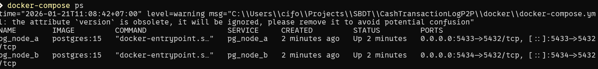

---

## 3.2 Konfigurasi Database

### 3.2.1 Struktur Tabel

Struktur tabel dibangun identik pada kedua node, terdiri dari tabel `nodes` sebagai metadata node dan tabel `transaction_logs` sebagai log transaksi pembayaran tunai dengan model append-only.

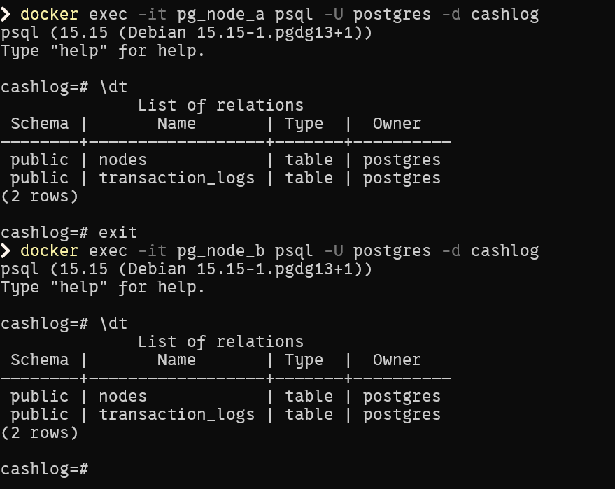
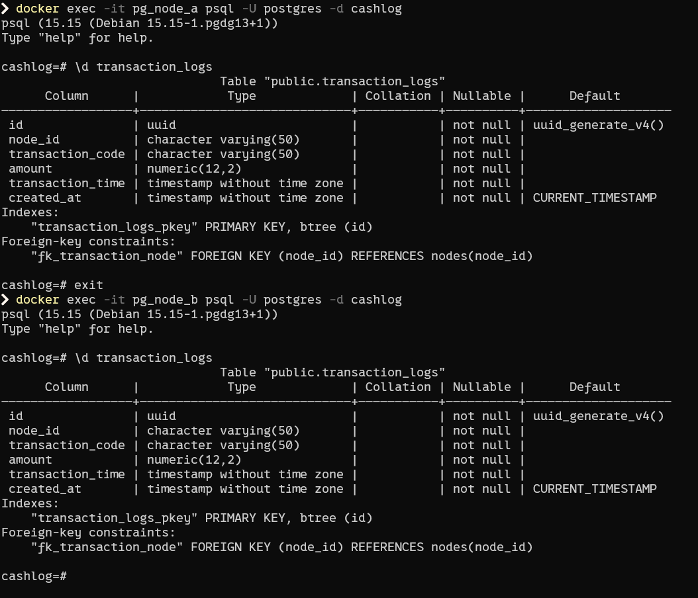

---

### 3.2.2 Konfigurasi WAL dan Role Replikasi

Logical replication membutuhkan pengaturan Write Ahead Log (WAL) pada level `logical`. Perubahan dilakukan langsung pada konfigurasi PostgreSQL dan diikuti dengan restart container.

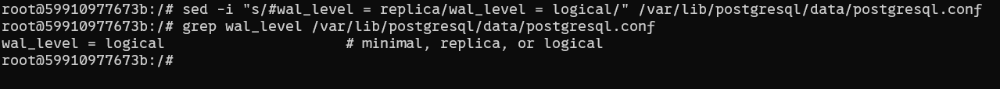
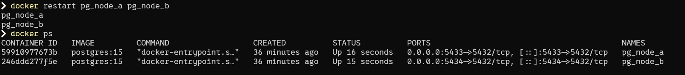

Role khusus replikasi dibuat dengan hak minimum, hanya memiliki kemampuan login, replication, dan koneksi ke database tanpa hak akses data bisnis.

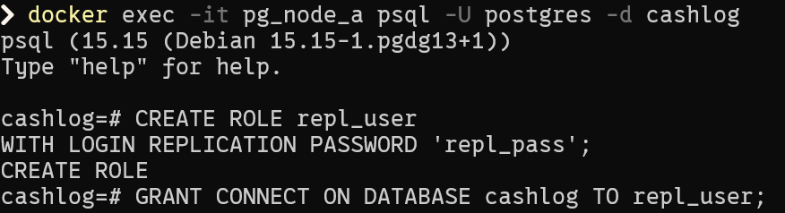

---

## 3.3 Implementasi Replikasi Normal (Node A → Node B)

Pada kondisi normal, Node A berperan sebagai publisher dan Node B sebagai subscriber. Publication dibuat di Node A khusus untuk tabel `transaction_logs`, sedangkan subscription dibuat di Node B.

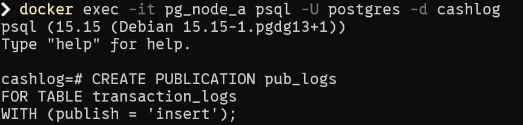
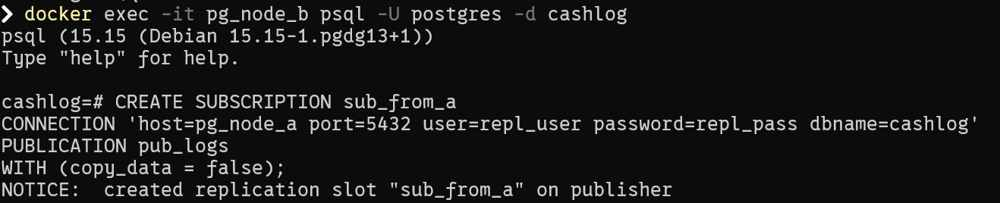

Status replication slot diverifikasi untuk memastikan worker replikasi aktif.

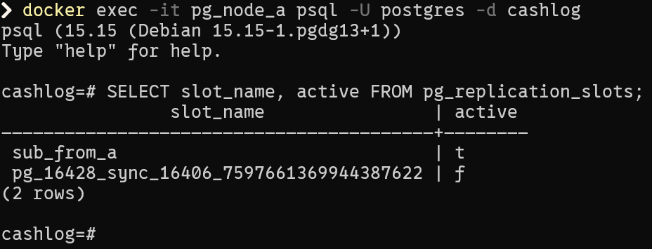

Pengujian dilakukan dengan melakukan insert transaksi pada Node A dan memverifikasi bahwa data tersebut muncul secara otomatis pada Node B.

---

## 3.4 Implementasi Failover dan Role Switch

Untuk mensimulasikan kegagalan node utama, Node A dihentikan sementara. Pada kondisi ini, Node B tetap dapat mencatat transaksi secara mandiri.

Setelah Node A diaktifkan kembali, dilakukan role switch dengan menjadikan Node B sebagai publisher dan Node A sebagai subscriber. Replikasi dijalankan dalam mode streaming tanpa initial data copy (`copy_data = false`).

Metadata node disinkronkan secara manual untuk memastikan integritas referensial terhadap foreign key.

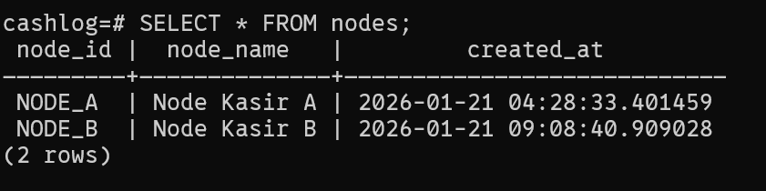
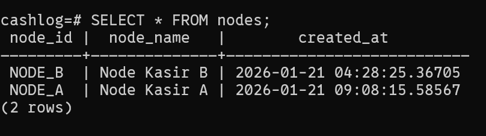

---
