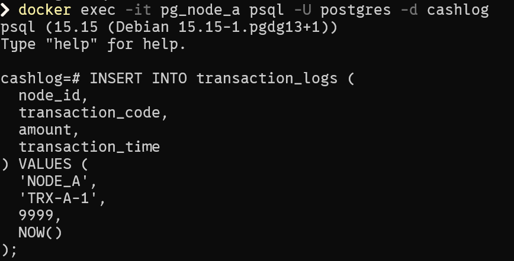
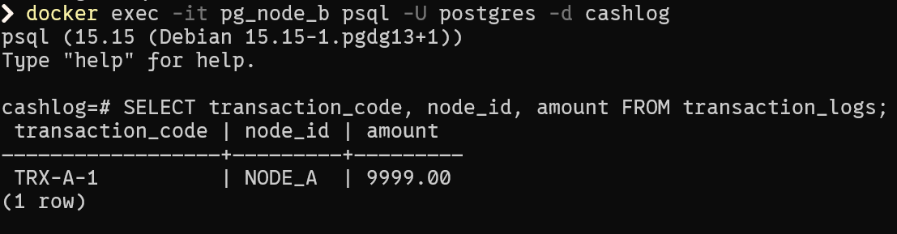
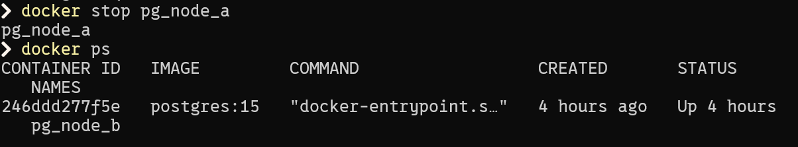
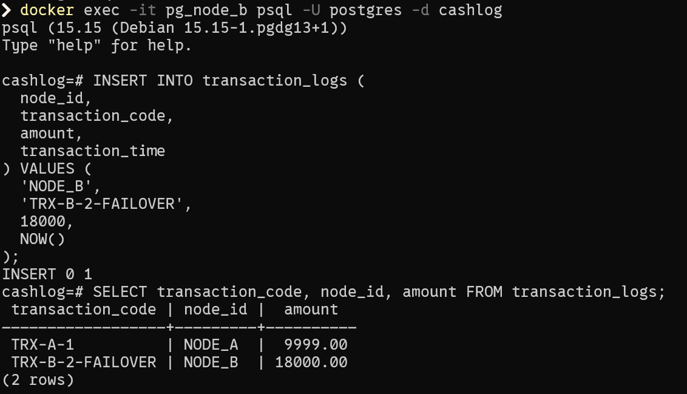
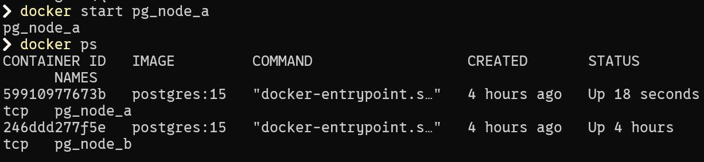
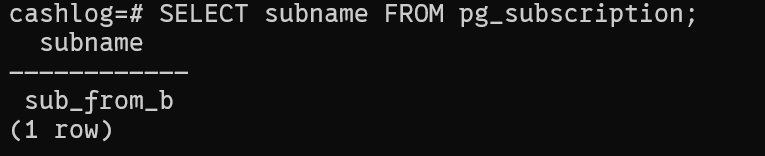

# BAB IV – PENGUJIAN DAN EVALUASI

## 4.1 Tujuan Pengujian

Pengujian dilakukan untuk memastikan bahwa sistem replikasi log transaksi pembayaran tunai berjalan sesuai dengan rancangan, khususnya pada skenario operasi normal, kondisi kegagalan node utama, serta proses pemulihan melalui mekanisme role switch.

---

## 4.2 Skenario Pengujian

### 4.2.1 Pengujian Replikasi Normal (Node A → Node B)

**Tujuan:** Memastikan data transaksi yang dicatat pada Node A dapat direplikasi secara otomatis ke Node B.

| Parameter        | Deskripsi                                      |
| ---------------- | ---------------------------------------------- |
| Kondisi awal     | Node A dan Node B aktif                        |
| Aksi             | Insert transaksi pada Node A                   |
| Hasil diharapkan | Data muncul di tabel `transaction_logs` Node B |
| Hasil aktual     | Sesuai harapan                                 |

---

### 4.2.2 Pengujian Ketahanan terhadap Kegagalan Node (Failover)

**Tujuan:** Memastikan sistem tetap dapat mencatat transaksi ketika node utama tidak aktif.

| Parameter        | Deskripsi                             |
| ---------------- | ------------------------------------- |
| Kondisi awal     | Node A aktif, Node B aktif            |
| Aksi             | Node A dihentikan (shutdown)          |
| Aksi lanjutan    | Insert transaksi pada Node B          |
| Hasil diharapkan | Transaksi berhasil tercatat di Node B |
| Hasil aktual     | Sesuai harapan                        |

---

### 4.2.3 Pengujian Pemulihan dan Role Switch (Node B → Node A)

**Tujuan:** Memastikan sistem dapat melanjutkan replikasi setelah node utama kembali aktif melalui mekanisme role switch.

| Parameter        | Deskripsi                                                         |
| ---------------- | ----------------------------------------------------------------- |
| Kondisi awal     | Node A kembali aktif                                              |
| Aksi             | Menjadikan Node B sebagai publisher dan Node A sebagai subscriber |
| Mekanisme        | Logical replication (streaming, `copy_data = false`)              |
| Hasil diharapkan | Data transaksi baru setelah role switch direplikasi ke Node A     |
| Hasil aktual     | Sesuai harapan                                                    |

---

## 4.3 Evaluasi Hasil Pengujian

Berdasarkan hasil pengujian yang dilakukan, sistem berhasil mereplikasi data transaksi pada kondisi normal dan tetap berfungsi saat terjadi kegagalan node utama. Proses role switch memungkinkan node cadangan mengambil alih peran pencatatan data tanpa menghentikan layanan.

Perlu dicatat bahwa data transaksi yang dicatat selama periode failover tidak disinkronkan kembali secara otomatis setelah node utama aktif kembali. Hal ini merupakan konsekuensi dari penggunaan mode streaming logical replication tanpa initial data copy (`copy_data = false`) dan diperlakukan sebagai keterbatasan desain yang disadari.

---

