# BAB III

## IMPLEMENTASI SISTEM BASIS DATA TERDISTRIBUSI

## 3.1 Gambaran Umum Implementasi Sistem

Bab ini membahas proses implementasi sistem basis data terdistribusi pada Platform Donasi Bencana Alam. Implementasi dilakukan berdasarkan hasil analisis dan perancangan yang telah dijelaskan pada BAB II. Fokus utama implementasi terletak pada penerapan arsitektur basis data terdistribusi berbasis wilayah, mekanisme replikasi master–replica, serta peran middleware dalam melakukan routing akses data.

Implementasi sistem bertujuan untuk membuktikan bahwa desain arsitektur yang diusulkan dapat direalisasikan secara teknis dan berfungsi sesuai dengan kebutuhan sistem, khususnya dalam hal ketersediaan layanan, konsistensi data, dan distribusi beban akses.

## 3.2 Lingkungan dan Teknologi Implementasi

Lingkungan implementasi sistem dirancang menggunakan pendekatan containerized environment. Setiap komponen sistem dijalankan dalam container terpisah untuk mempermudah pengelolaan dan isolasi layanan.

Teknologi utama yang digunakan dalam implementasi sistem adalah sebagai berikut:

1. PostgreSQL sebagai sistem manajemen basis data.
2. Mekanisme replikasi PostgreSQL dengan arsitektur master–replica.
3. Docker sebagai platform containerisasi.
4. Middleware berbasis Node.js untuk routing akses data.
5. Client berbasis web sebagai antarmuka akses sistem.

## 3.3 Implementasi Arsitektur Sistem

Implementasi arsitektur sistem mengikuti desain arsitektur terdistribusi berbasis wilayah. Sistem terdiri dari satu node basis data master dan beberapa node basis data replika yang mewakili wilayah tertentu.

Node basis data master berperan sebagai pusat operasi penulisan data, sedangkan node replika berfungsi untuk melayani permintaan pembacaan data. Seluruh komponen tersebut dihubungkan melalui middleware yang bertindak sebagai pengatur alur komunikasi antara client dan basis data.

Pendekatan ini memungkinkan pemisahan beban kerja antara operasi baca dan tulis, serta meningkatkan ketersediaan layanan apabila salah satu node mengalami gangguan.

## 3.4 Implementasi Fragmentasi Data dan Replikasi

Fragmentasi data pada sistem ini diterapkan dalam bentuk fragmentasi horizontal secara logis berdasarkan wilayah bencana. Fragmentasi tidak dilakukan melalui pemisahan tabel secara fisik di tingkat DBMS, melainkan dikendalikan oleh middleware.

Pada implementasinya, data bencana dan transaksi donasi diarahkan ke node basis data wilayah yang sesuai berdasarkan parameter wilayah. Tabel-tabel turunan mengikuti distribusi data tabel induk, sehingga fragmentasi yang diterapkan bersifat derivatif.

Mekanisme replikasi diterapkan untuk memastikan bahwa data yang tersimpan pada node master disalin ke seluruh node replika. Dengan demikian, node replika dapat digunakan sebagai sumber data baca untuk meningkatkan ketersediaan layanan.

## 3.5 Implementasi Middleware dan Routing Data

Middleware diimplementasikan sebagai lapisan perantara antara client dan sistem basis data terdistribusi. Middleware bertanggung jawab untuk menerima permintaan dari client, menentukan wilayah bencana berdasarkan parameter permintaan, dan mengarahkan permintaan tersebut ke node basis data yang sesuai.

Pada proses penulisan data, middleware selalu mengarahkan permintaan ke node basis data master untuk menjaga konsistensi data. Sementara itu, pada proses pembacaan data, middleware dapat mengarahkan permintaan ke node replika sesuai dengan wilayah yang ditentukan.

Pendekatan ini memungkinkan client berinteraksi dengan sistem tanpa perlu mengetahui detail distribusi basis data.

## 3.6 Implementasi Deployment Sistem

Deployment sistem dilakukan menggunakan Docker dengan memisahkan setiap komponen ke dalam container yang berbeda. Pendekatan ini memudahkan proses pengelolaan layanan, pengujian, serta simulasi penambahan node basis data wilayah.

Setiap container dijalankan dalam satu lingkungan jaringan virtual, sehingga komunikasi antar komponen sistem dapat dilakukan secara terkontrol dan terisolasi.

## 3.7 Dokumentasi Implementasi Sistem

Sebagai bukti bahwa sistem telah berhasil diimplementasikan, dokumentasi pada bab ini disajikan dalam bentuk tangkapan layar (screenshot) yang dituliskan menggunakan format markdown. Screenshot dipilih untuk menunjukkan kondisi aktual sistem saat dijalankan, mulai dari proses deployment hingga akses data melalui middleware.

### 3.7.1 Deployment Container Sistem

Tahap awal implementasi sistem ditunjukkan melalui proses menjalankan seluruh container menggunakan Docker. Gambar berikut memperlihatkan bahwa layanan basis data master, basis data replika, middleware, dan client telah berhasil dijalankan.

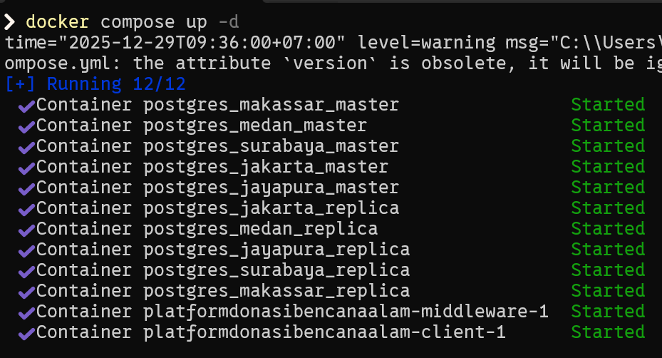

Untuk memastikan setiap container berjalan sesuai perannya, dilakukan pengecekan status container menggunakan perintah Docker. Hasil pengecekan ditunjukkan pada gambar berikut.

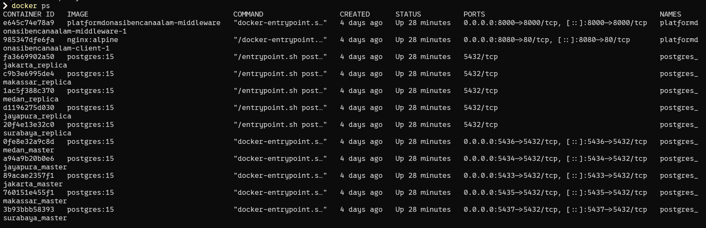

Kedua tangkapan layar tersebut membuktikan bahwa lingkungan sistem terdistribusi telah aktif dan siap digunakan.

### 3.7.2 Implementasi Replikasi Basis Data

Implementasi replikasi basis data dilakukan pada node basis data wilayah Surabaya sebagai perwakilan node master dan replika. Gambar berikut menunjukkan node master PostgreSQL yang berjalan dan siap menerima operasi penulisan data.

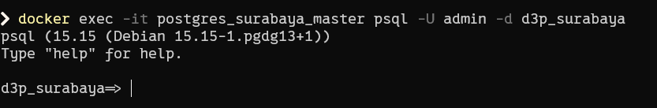

Proses penulisan data bencana dilakukan melalui node master untuk menjaga konsistensi data.

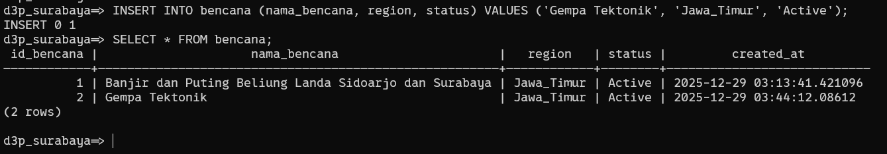

Setelah data ditulis pada node master, data tersebut direplikasi ke node replika. Kondisi node replika PostgreSQL ditunjukkan pada gambar berikut.

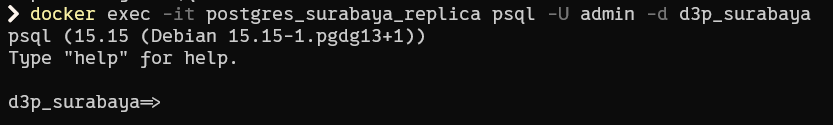

Untuk memverifikasi keberhasilan replikasi, dilakukan proses pembacaan data melalui node replika.

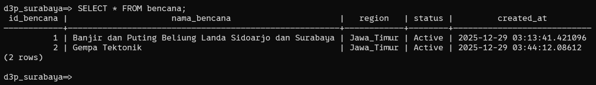

Rangkaian tangkapan layar ini menunjukkan bahwa mekanisme replikasi master–replica berjalan sesuai dengan perancangan sistem.

### 3.7.3 Implementasi Middleware dan Akses Data

Implementasi middleware diuji dengan melakukan operasi insert data bencana dari wilayah yang berbeda. Gambar berikut menunjukkan proses insert data bencana ke node basis data tertentu berdasarkan wilayah.

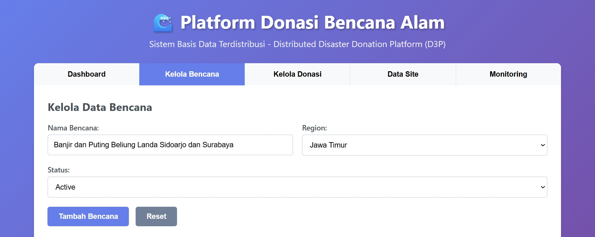

Hasil penyimpanan data pada node wilayah asal ditunjukkan pada gambar berikut.

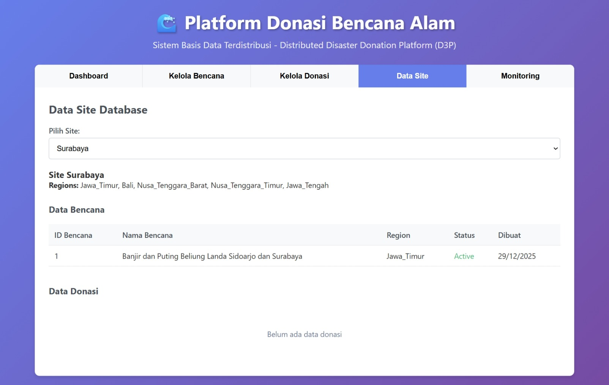

Sementara itu, pengecekan pada node wilayah lain menunjukkan bahwa data tersebut tidak disimpan secara lokal, sesuai dengan strategi fragmentasi horizontal logis.

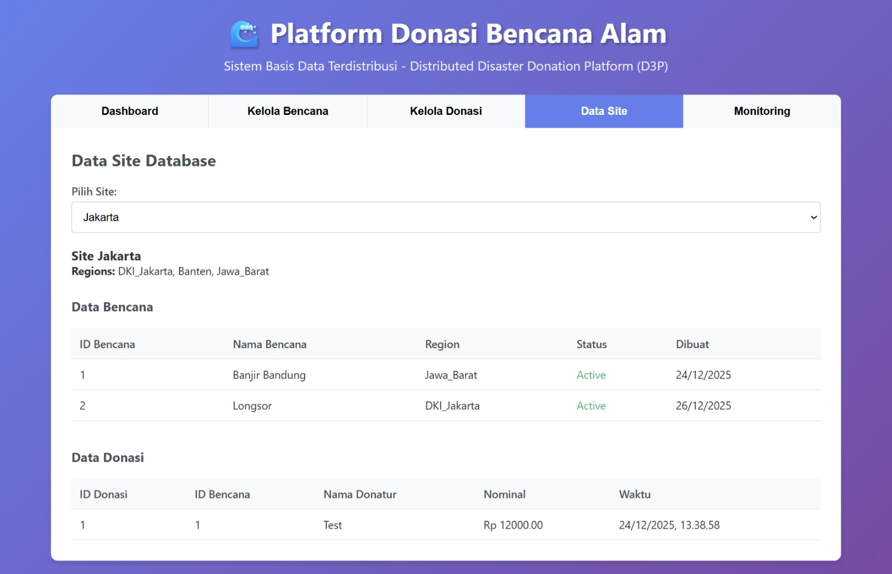

Selanjutnya, proses routing data oleh middleware ditunjukkan melalui pengujian akses dari wilayah Jakarta dan Jayapura.

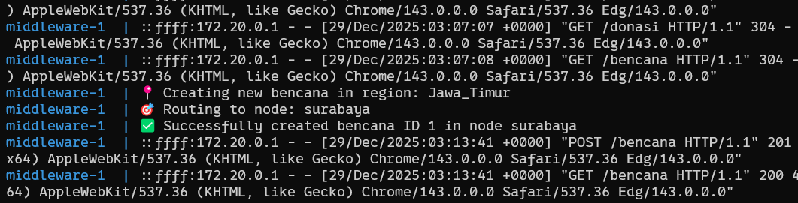

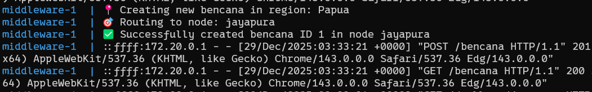

Rangkaian tangkapan layar ini membuktikan bahwa middleware berhasil melakukan routing permintaan client ke node basis data yang sesuai berdasarkan wilayah.

## 3.8 Ringkasan Implementasi

Berdasarkan hasil implementasi dan dokumentasi yang disajikan, sistem basis data terdistribusi berbasis wilayah dengan mekanisme replikasi master–replica telah berhasil direalisasikan. Implementasi menunjukkan bahwa middleware mampu melakukan routing data sesuai wilayah, serta mekanisme replikasi dapat mendukung ketersediaan layanan dan konsistensi data sesuai dengan tujuan penelitian.
