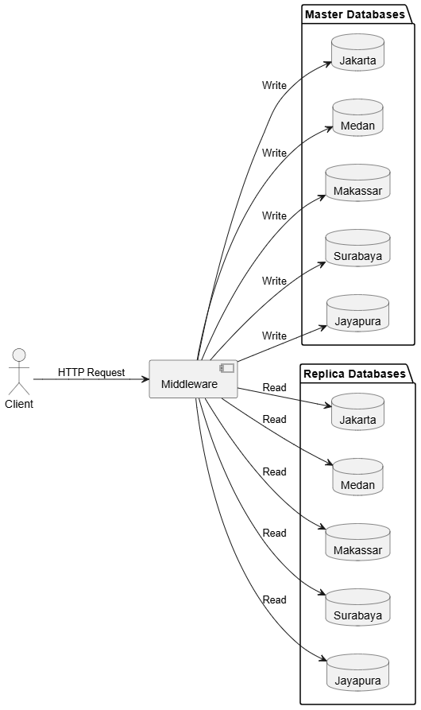
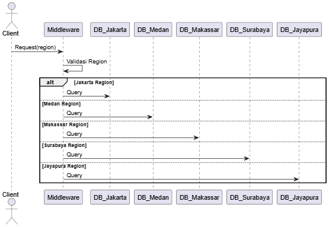
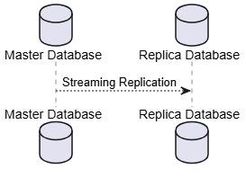
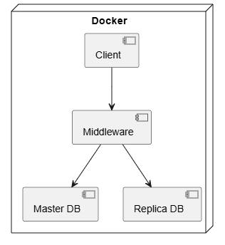

# BAB III  
## METODOLOGI DAN PERANCANGAN SISTEM

---

## 3.1 Gambaran Umum Arsitektur Sistem

Sistem ini dirancang menggunakan pendekatan **arsitektur sistem terdistribusi berbasis wilayah (region-based distributed system)** untuk pengelolaan data bencana. Pendekatan ini bertujuan meningkatkan skalabilitas, ketersediaan layanan, serta efisiensi akses data berdasarkan kedekatan geografis.

Arsitektur sistem terdiri atas empat komponen utama, yaitu:
1. Client
2. Middleware
3. Database Master
4. Database Replica pada setiap node wilayah

Seluruh interaksi client dengan basis data dilakukan melalui middleware sebagai _single entry point_ untuk menjamin kontrol akses dan konsistensi data.

### Diagram Arsitektur Global Sistem

## 3.2 Pembagian Node dan Wilayah Layanan

Sistem membagi wilayah layanan ke dalam beberapa node regional. Setiap node bertanggung jawab atas pengelolaan data bencana berdasarkan cakupan wilayah administratif tertentu.

**Tabel Pembagian Node dan Region**

| Node     | Region                                                                                        |
| -------- | --------------------------------------------------------------------------------------------- |
| Jakarta  | DKI_Jakarta, Banten, Jawa_Barat                                                               |
| Jayapura | Papua, Papua_Barat                                                                            |
| Makassar | Sulawesi_Selatan, Sulawesi_Barat, Sulawesi_Tengah, Sulawesi_Tenggara, Gorontalo               |
| Medan    | Sumatera_Utara, Aceh, Riau, Sumatera_Barat, Jambi, Sumatera_Selatan, Lampung, Bangka_Belitung |
| Surabaya | Jawa_Timur, Jawa_Tengah, Bali, Nusa_Tenggara_Barat, Nusa_Tenggara_Timur                       |

Pembagian ini bertujuan mengurangi latensi, membatasi ruang lingkup data, serta mempermudah pengelolaan replikasi database.

## 3.3 Perancangan Middleware

Middleware berfungsi sebagai lapisan logika utama yang menjembatani client dengan sistem basis data terdistribusi. Middleware bertanggung jawab terhadap:

- Validasi region
- Routing permintaan ke node yang sesuai
- Pemisahan operasi baca dan tulis
- Penanganan kegagalan koneksi database

Middleware menentukan node tujuan berdasarkan parameter region yang dikirimkan oleh client.

### Diagram Alur Routing Middleware

## 3.4 Perancangan Basis Data Terdistribusi

Basis data menggunakan PostgreSQL dengan pola master–replica. Database master menangani seluruh operasi penulisan data, sedangkan database replica hanya melayani operasi pembacaan data.

Replikasi dilakukan secara asinkron untuk meningkatkan ketersediaan data serta mengurangi beban baca pada database master.

### Diagram Replikasi Database

## 3.5 Pengaturan Hak Akses dan Keamanan Data

Keamanan sistem diterapkan melalui mekanisme role-based access control (RBAC). Middleware menggunakan akun database dengan hak terbatas sesuai prinsip least privilege.

Pengaturan ini bertujuan untuk:
- Mencegah akses tidak sah
- Mengurangi risiko kesalahan operasional
- Memisahkan hak administratif dan operasional

## 3.6 Deployment Sistem Menggunakan Docker

Seluruh komponen sistem dideploy menggunakan Docker untuk memastikan konsistensi lingkungan dan kemudahan replikasi sistem.

Struktur deployment mencakup:
- Container client
- Container middleware
- Container database master
- Container database replica

### Diagram Deployment Sistem

## 3.7 Alur Operasional Sistem
Alur operasional sistem adalah sebagai berikut:
1. Client mengirimkan permintaan ke middleware
2. Middleware memvalidasi region
3. Middleware menentukan node tujuan
4. Middleware meneruskan permintaan ke database yang sesuai
5. Database memproses permintaan
6. Middleware mengirimkan respons ke client

Alur ini memastikan konsistensi dan keamanan data bencana antar wilayah.