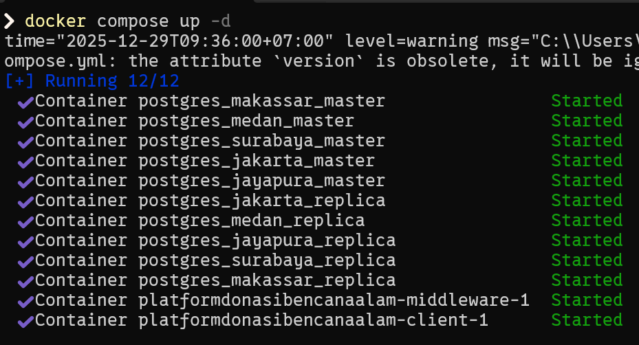
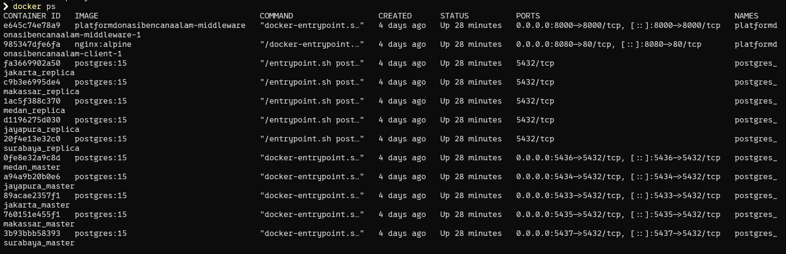
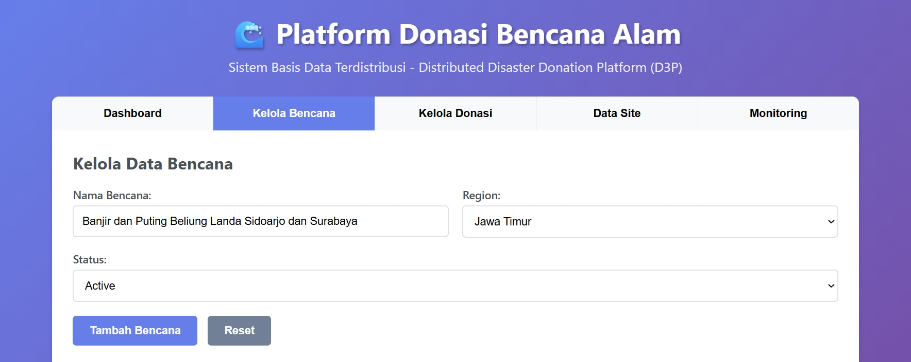
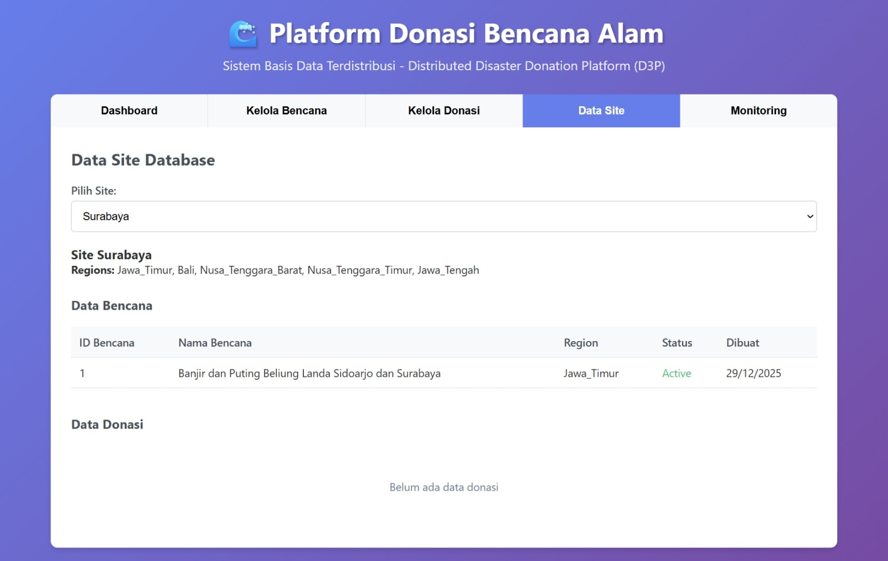
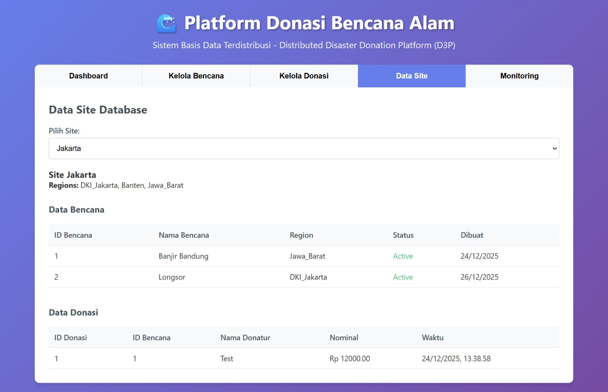
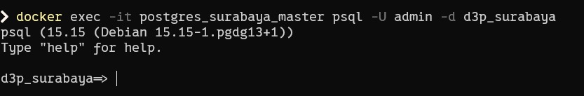
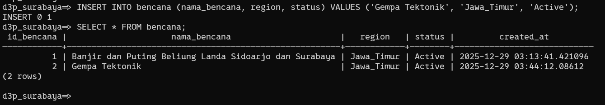
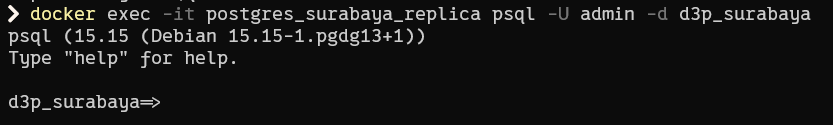
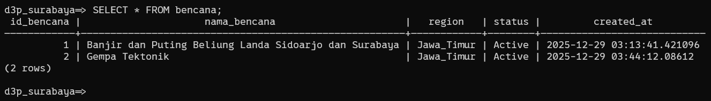

# BAB IV
## IMPLEMENTASI DAN PENGUJIAN SISTEM

### 4.1 Implementasi Lingkungan Sistem
Tahap implementasi sistem dilakukan menggunakan teknologi containerization dengan Docker untuk memastikan setiap komponen sistem berjalan secara terisolasi dan konsisten. Arsitektur sistem terdiri dari beberapa node database PostgreSQL yang mewakili masing-masing wilayah (site), middleware sebagai pengatur routing permintaan data, serta client berbasis web sebagai antarmuka pengguna.

Setiap node wilayah memiliki satu database master dan satu database replica yang terhubung melalui mekanisme replikasi PostgreSQL. Middleware berperan sebagai penghubung antara client dan database dengan menentukan node tujuan berdasarkan atribut wilayah bencana.

### 4.2 Implementasi Container dan Orkestrasi Docker

Seluruh komponen sistem dijalankan menggunakan `docker-compose` untuk memudahkan pengelolaan multi-container dalam satu lingkungan terintegrasi. Perintah berikut digunakan untuk menjalankan seluruh layanan:
```
docker compose up -d
```

Keberhasilan proses ini ditunjukkan dengan seluruh container berjalan dalam status aktif.




### 4.3 Implementasi Fragmentasi Data Horizontal

Fragmentasi data horizontal diterapkan pada tabel `bencana`, di mana setiap node hanya menyimpan data bencana sesuai dengan wilayah yang telah ditentukan. Middleware melakukan validasi dan routing berdasarkan nilai region yang dikirimkan oleh client.

Sebagai contoh, data dengan region **Jawa_Timur** akan diarahkan ke node **Surabaya**, sementara data dengan region **DKI_Jakarta** akan diarahkan ke node **Jakarta**.

#### Pengujian Insert Data Bencana

Pengujian dilakukan dengan menambahkan data bencana melalui aplikasi client.



#### Verifikasi Data pada Node Tujuan

Data hasil insert hanya muncul pada node yang sesuai dengan wilayahnya.



#### Verifikasi Isolasi Data Antar Node

Dilakukan pengecekan pada node lain untuk memastikan data tidak tersimpan di wilayah yang tidak sesuai.



Hasil pengujian menunjukkan bahwa fragmentasi horizontal berjalan dengan baik, di mana data hanya tersimpan pada node yang relevan.

### 4.4 Implementasi Middleware dan Routing Data

Middleware diimplementasikan menggunakan Node.js dan berfungsi sebagai pusat logika distribusi data. Middleware memanfaatkan direktori global yang berisi pemetaan wilayah terhadap node database master dan replica.

Alur kerja middleware adalah sebagai berikut:
1. Menerima permintaan dari client
2. Melakukan validasi region
3. Menentukan node tujuan
4. Meneruskan query ke database yang sesuai

Pendekatan ini memastikan client tidak perlu mengetahui detail lokasi fisik data.

### 4.5 Implementasi Replikasi Database

Replikasi database diterapkan menggunakan mekanisme PostgreSQL Streaming Replication, di mana database replica akan menerima salinan data secara otomatis dari database master.

#### Pengujian Replikasi

Pengujian dilakukan dengan langkah-langkah berikut:
1. Melakukan insert data pada database master
2. Melakukan query pada database replica
3. Membandingkan hasil data

#### Insert Data pada Master

Data ditambahkan langsung pada database master wilayah Surabaya.




#### Verifikasi Data pada Replica

Dilakukan query pada database replica untuk memastikan data yang sama tersedia.




Hasil pengujian menunjukkan bahwa data yang ditambahkan pada database master secara otomatis tersinkronisasi ke database replica tanpa intervensi manual, menandakan replikasi berjalan dengan baik.

### 4.6 Hasil Pengujian Sistem

Berdasarkan seluruh tahapan pengujian yang telah dilakukan, sistem menunjukkan hasil sebagai berikut:
- Fragmentasi data horizontal berhasil diterapkan
- Routing data oleh middleware berjalan sesuai wilayah
- Replikasi database master–replica berjalan otomatis
- Isolasi data antar node terjaga dengan baik

Dengan demikian, sistem telah memenuhi tujuan perancangan yang ditetapkan pada tahap awal.

### 4.7 Pembahasan

Implementasi sistem platform donasi bencana alam berbasis database terdistribusi ini menunjukkan bahwa pendekatan fragmentasi horizontal dan replikasi mampu meningkatkan skalabilitas dan konsistensi data. Penggunaan middleware sebagai pengatur distribusi data juga memberikan fleksibilitas dalam pengembangan sistem ke depannya, khususnya jika terjadi penambahan wilayah baru.